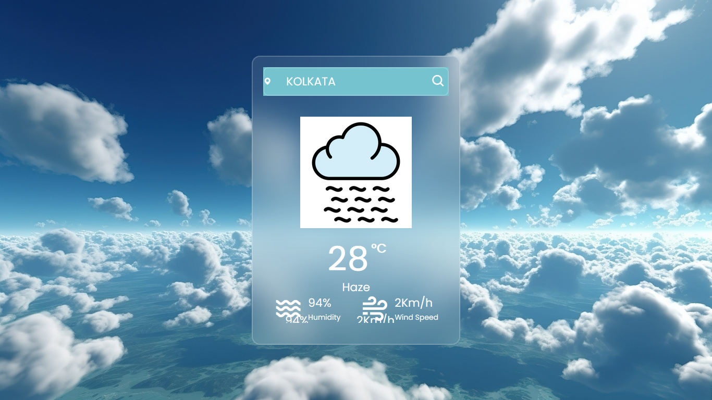

# Weather-App

## Overview

The Weather-App is a dynamic web application that provides real-time weather information based on user input. It fetches weather data from the OpenWeatherMap API and displays it with engaging animations and user-friendly visuals.

## Features

- **Real-time Weather Information:** Displays current weather conditions for any location.
- **Dynamic Visual Updates:** Animated transitions for weather information and error messages.
- **Error Handling:** Displays a message when the location is not found.
- **Responsive Design:** Adapts to various screen sizes for better usability.


## Images 


  

## Installation

1. **Clone the Repository:**

   ```bash
   git clone https://github.com/yourusername/weather-app.git
